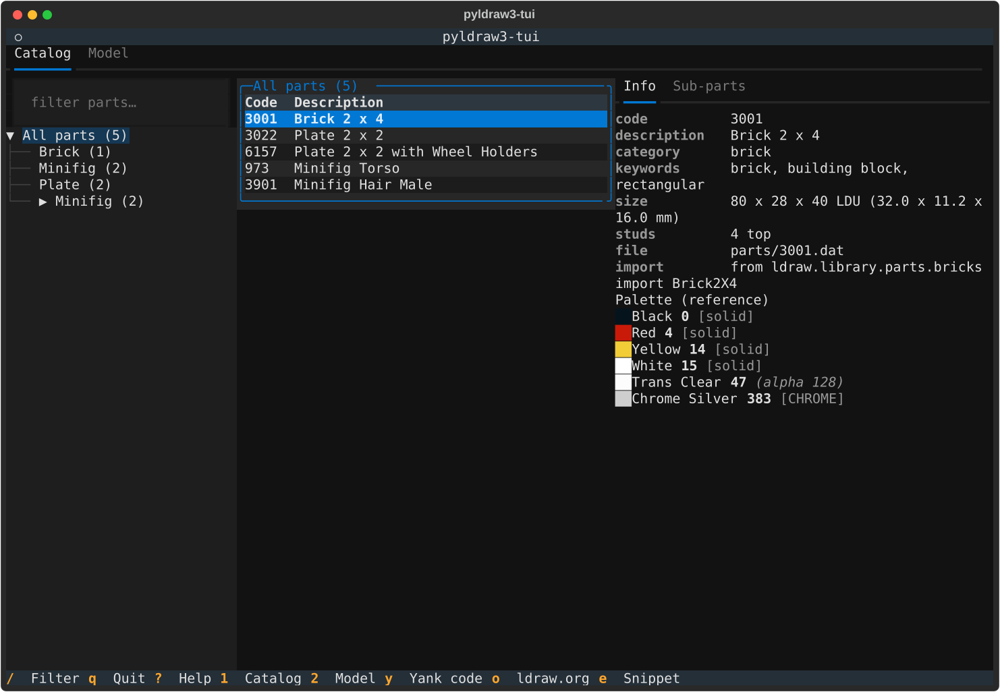
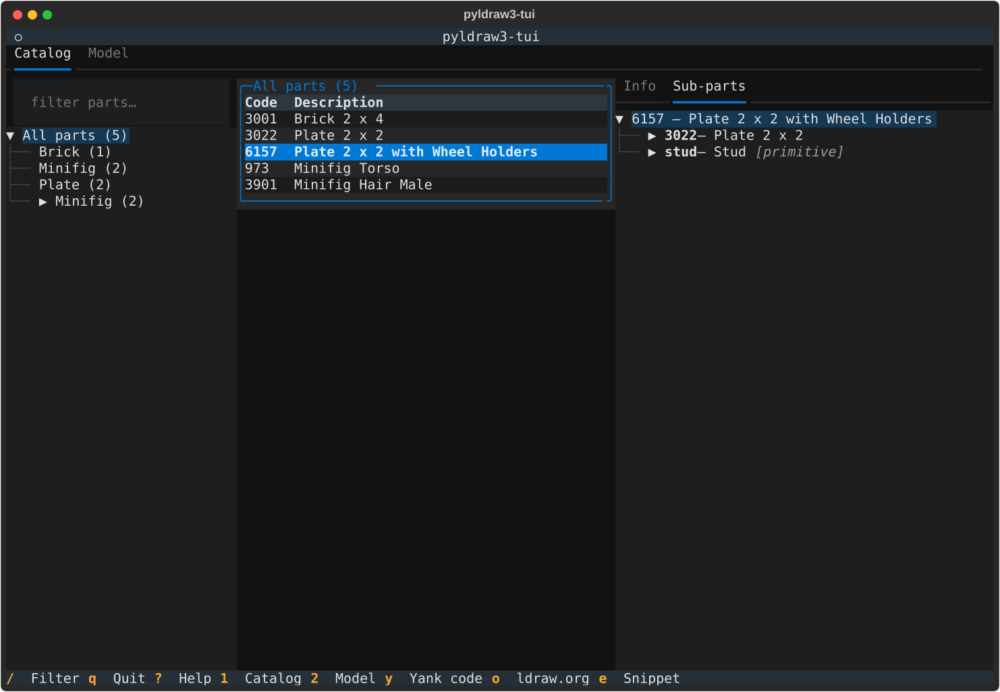
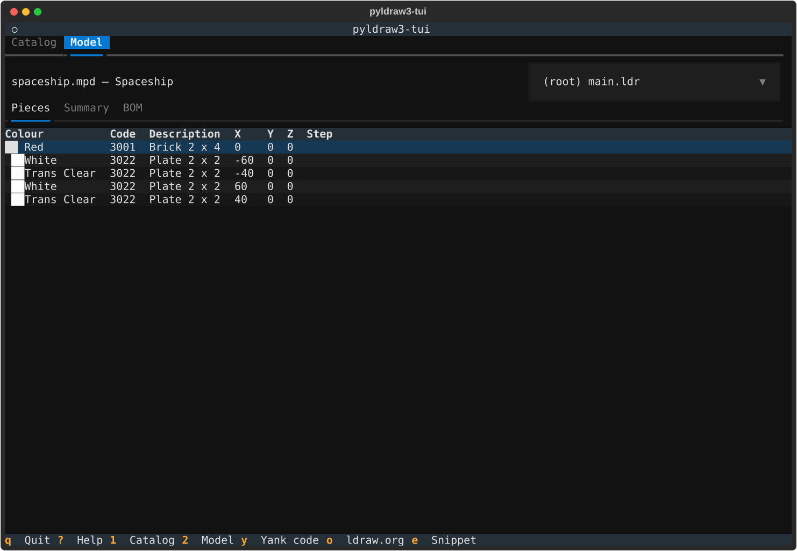
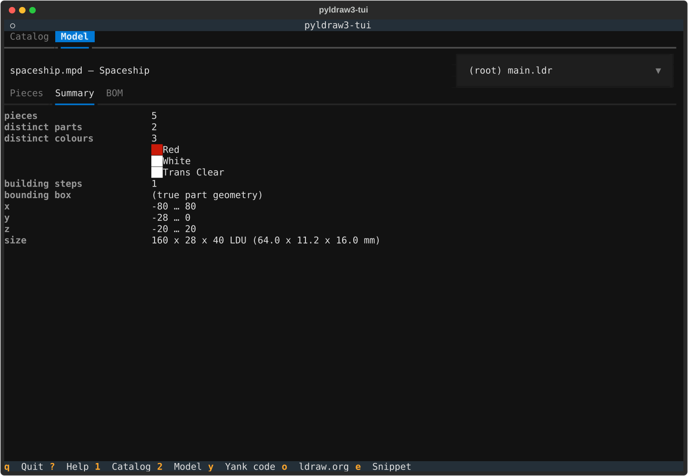

# pyldraw3-tui

[](https://github.com/hbmartin/pyldraw3-tui/actions/workflows/lint-test.yml)
[](https://pypi.org/project/pyldraw3-tui/)
[](https://www.python.org/downloads/)
[](LICENSE.txt)

A terminal user interface for **browsing the LDraw parts catalog** and **inspecting LDraw model
files** — built on [Textual](https://textual.textualize.io/) and
[pyldraw3](https://github.com/hbmartin/pyldraw3).

[LDraw](https://ldraw.org) is the open standard for describing LEGO® models as plain-text
`.ldr`/`.mpd` files. `pyldraw3-tui` is the read-only companion to the `pyldraw3` library: it never
creates, edits, or exports model or geometry files — it just lets you explore parts and models
fast, without leaving your terminal.

> **Companion projects:** [`hbmartin/rebrickable`](https://github.com/hbmartin/rebrickable)
> provides the typed offline catalog, API v3 client, inventories, and LDraw cross-referencing used
> here. [`hbmartin/legolization`](https://github.com/hbmartin/legolization/) turns voxel or existing
> LDraw models into physically checked LEGO models with bills of materials and build instructions.

**What you get:**

- 🔎 Look up a part code or description in seconds — no browser, no 3D viewer.
- 📖 Read any `.ldr`/`.mpd` model's pieces, bounding box, and bill of materials as plain text.
- 🧱 Follow section-local building steps, rotations, camera state, LPub inventories, and directives.
- 🌐 Browse Rebrickable parts, sets, inventories, and read-only collections—offline after one
  explicit catalog refresh, with live reads only when requested.
- 🔗 Translate the displayed LDraw BOM into Rebrickable part/color identifiers without hiding
  ambiguous or unresolved mappings.
- 🔍 Validate model files — structural diagnostics plus semantic instruction issues.
- 🎨 Preview the full LDraw colour palette with swatches and finish metadata.
- 📋 Yank codes or export ready-to-paste Python snippets straight into your scripts.
- ⌨️ Fully keyboard-driven (with mouse support), running entirely in your terminal.

> **Status:** Beta (v0.3.0). Usable day-to-day; interfaces and key bindings may still change
> between releases. Bug reports and feedback are very welcome.

## Screenshots

<table>
  <tr>
    <td align="center">
      <a href="docs/screenshots/catalog.svg"></a>
      <br><sub><b>Catalog</b> — browse categories, filter parts, inspect metadata</sub>
    </td>
    <td align="center">
      <a href="docs/screenshots/part-detail.svg"></a>
      <br><sub><b>Part detail</b> — drillable sub-part reference tree</sub>
    </td>
  </tr>
  <tr>
    <td align="center">
      <a href="docs/screenshots/model-pieces.svg"></a>
      <br><sub><b>Model pieces</b> — every placement with its colour and position</sub>
    </td>
    <td align="center">
      <a href="docs/screenshots/model-summary.svg"></a>
      <br><sub><b>Model summary</b> — counts, colours, and a real bounding box in LDU/mm</sub>
    </td>
  </tr>
</table>

<sub>Captured against the small test-fixture library (regenerate with
`uv run python scripts/make_screenshots.py`); a real install browses the full LDraw catalog.</sub>

## Contents

- [Screenshots](#screenshots)
- [Installation](#installation)
- [Usage](#usage)
- [Features](#features)
- [First run](#first-run)
- [Key bindings](#key-bindings)
- [Troubleshooting](#troubleshooting)
- [pyldraw3-tui vs. pyldraw3](#pyldraw3-tui-vs-pyldraw3)
- [Contributing](#contributing)
- [License](#license)

## Installation

Requires **Python 3.12+** and a terminal.

Run it without installing anything (recommended):

```sh
uvx pyldraw3-tui
```

Or install it as a persistent command-line tool:

```sh
uv tool install pyldraw3-tui   # via uv
pipx install pyldraw3-tui      # or via pipx
```

Or grab it with the standalone [uvx.sh](https://uvx.sh) installer script (no Python toolchain
required up front — it bootstraps `uv` for you):

```sh
curl -LsSf uvx.sh/pyldraw3-tui/install.sh | sh
```

Want the latest unreleased build? Install straight from source:

```sh
uvx --from git+https://github.com/hbmartin/pyldraw3-tui pyldraw3-tui
uv tool install git+https://github.com/hbmartin/pyldraw3-tui
```

## Usage

```sh
pyldraw3-tui [FILE]
```

With no argument it opens on the **Catalog**; given a `.ldr`/`.mpd` path it opens on the **Model**
view for that file. Switch modes in-app via the three top tabs: **Catalog**, **Model**, and
**Rebrickable**.

## Features

The app is organised around its three top tabs.

**Catalog** — browse and look up parts:

- **Look up part codes** — find a part's code/description fast to paste into scripts or `.ldr` files.
- **Explore the catalog** — browse categories and minifig sections to discover parts.
- **Inspect a part** — metadata, palette swatches, and a drillable sub-part reference tree.

**Model** — read a model file:

- **Browse a model file** — open a `.ldr`/`.mpd` and read its pieces, summary stats, and bill of materials.
- **See real geometry** — per-piece bounding boxes and stud counts, plus an overall model bounding box in LDU/mm.
- **Follow semantic instructions** — switch to Instructions mode to navigate each reachable MPD
  section's independent `STEP`/`ROTSTEP` sequence, cumulative geometry, rotation and camera state,
  callouts, groups, page breaks, suppression, and lossless LPub/PYLDRAW directives.
- **Inspect step inventories** — the PLI shows parts added by the selected step while the BOM shows
  the cumulative build; LPub PLI/BOM/PART ignore ranges affect inventory without hiding geometry.
- **Validate the file** — the Issues tab combines malformed lines, unknown parts and colours,
  suspicious transforms, and semantic instruction problems with section, line, severity, and stable
  issue code. Files that fail to parse entirely still get an issue list explaining what is wrong.
- **Translate the current BOM** — the Rebrickable subtab follows the selected root model, submodel,
  or cumulative instruction step and reports resolved, ambiguous, and unresolved part/color
  mappings with candidates and provenance. Full or incomplete-only reports can be copied as
  deterministic CSV or JSON.

**Rebrickable** — browse the official catalog and optional read-only account data:

- **Browse without an API key** — local part/set search, metadata, newest set inventories, public
  page links, and LDraw translation use the downloaded snapshot and perform no network I/O.
- **Refresh explicitly** — the TUI downloads and transactionally promotes all 12 catalog datasets
  only after you confirm Refresh. A failed or cancelled refresh leaves the prior snapshot active.
- **Fetch live data deliberately** — a selected part or set can fetch fresh details, and sets can
  separately fetch their live inventory. These actions use the library's paced API client.
- **Read collections without editing them** — owned sets, loose parts, part lists, and set lists are
  available when API and user tokens are supplied. The TUI exposes no collection mutation actions.
- **No images** — upstream image URLs remain response metadata, but the TUI never downloads,
  caches, renders, copies, or opens them; `o` opens the entity's Rebrickable page instead.

The instruction browser is renderer-neutral and read-only. It does not generate images, PDF/HTML
instructions, manifests, or snapshot artifacts, and it does not edit instruction metadata.

## First run

On launch the app reads your [pyldraw3](https://github.com/hbmartin/pyldraw3) configuration. If no
LDraw library is found on disk, a guided setup screen offers to download the library (~80 MB),
point your configuration at it, and generate the parts index. If the index is missing or stale it
is rebuilt automatically with a progress indicator — the first build takes a few seconds; later
launches are instant.

Everything lives under your platform's standard directories (resolved by
[platformdirs](https://pypi.org/project/platformdirs/)):

| What                          | macOS                                                | Linux                              |
| ----------------------------- | ---------------------------------------------------- | ---------------------------------- |
| Config file (`config.yml`)    | `~/Library/Application Support/pyldraw3/`            | `~/.config/pyldraw3/`              |
| LDraw library (download)      | `~/Library/Caches/pyldraw3/`                         | `~/.cache/pyldraw3/`               |
| Generated parts index         | `~/Library/Application Support/pyldraw3/generated/`  | `~/.local/share/pyldraw3/generated/` |

The exact library and index paths are recorded in `config.yml`; the values above are the defaults.
Windows uses the equivalent `%LOCALAPPDATA%` locations.

### Rebrickable catalog and credentials

Rebrickable data uses the platform-standard `rebrickable` application-data and cache directories,
separate from the LDraw library above. Open the **Rebrickable** tab and choose **Refresh** once to
download the 12 public CSV datasets (currently about 18 MB compressed and roughly 275 MB as a local
SQLite snapshot). This refresh does not require an API key; subsequent browsing, inventories, page
links, exports, and LDraw translation are offline.

Live public reads are optional. Supply the API key through the environment rather than a command-line
argument:

```sh
export REBRICKABLE_API_KEY='…'
pyldraw3-tui
```

Read-only personal collection views additionally require a Rebrickable user token. Set
`REBRICKABLE_USER_TOKEN` or enter an existing token in the masked **Token** prompt; prompted tokens
remain in memory only for the current run. Neither credential is written by the TUI. Live reads are
explicit and paced conservatively; after a rate-limit response the client honors the server's retry
delay and the TUI reports the failure without immediately retrying in a loop.

## Key bindings

**Navigation**

| Key                 | Action                              |
| ------------------- | ----------------------------------- |
| `↑`/`↓`, `k`/`j`    | Move within the focused list/tree   |
| `h`/`l`             | Collapse/expand tree nodes          |
| `Tab` / `Shift+Tab` | Cycle focusable panes               |
| `Enter`             | Open/drill selection                |
| `/`                 | Focus the live filter box           |

**Actions**

| Key       | Action                                                    |
| --------- | -------------------------------------------------------- |
| `y` / `Y` | Yank code / chooser (description, import path)           |
| `o`       | Open the selected LDraw or Rebrickable entity page        |
| `e`       | Export Python snippet (import / `Piece(...)` / bare code) |

**Model instructions**

| Key       | Action                                         |
| --------- | ---------------------------------------------- |
| `i`       | Toggle Whole model / Instructions mode         |
| `[` / `]` | Select the previous / next section-local step  |

**Global**

| Key            | Action                                                  |
| -------------- | ------------------------------------------------------ |
| `1` / `2` / `3` | Switch to Catalog / Model / Rebrickable tab           |
| `:`            | Command palette (jump to part, open model, copy BOM, …) |
| `Ctrl+T`       | Toggle light/dark theme                                |
| `?`            | Help (full key reference)                              |
| `q` / `Ctrl+C` | Quit                                                   |

Full mouse support comes for free with Textual.

## Troubleshooting

**"No LDraw library found" on first launch.**
The app needs the LDraw parts library on disk. Let the guided setup screen download it (~80 MB,
needs network access), or if you already have an LDraw install, point `config.yml` at it (see
[First run](#first-run) for the path) and relaunch.

**The parts index rebuild is slow or seems stuck.**
The first index build scans the whole library and takes a few seconds; a progress indicator shows
its status. Subsequent launches reuse the cached index and start instantly. If it never completes,
delete the `generated/` directory (see the paths table above) and relaunch to force a clean rebuild.

**Colours or swatches look wrong / boxes render as garbage.**
The UI expects a modern terminal with truecolor and Unicode support. Make sure `TERM` advertises
256+ colours (e.g. `xterm-256color`) and that your terminal font includes box-drawing glyphs.
Try a different terminal emulator if artifacts persist.

**Can I use my existing LDraw installation instead of downloading?**
Yes — set the library path in `config.yml` to your existing LDraw directory. The paths are shared
with `pyldraw3`, so any configuration that library already uses is picked up automatically.

**Where does it store things / how do I reset?**
Everything lives under the platform directories listed in [First run](#first-run). Deleting the
config and `generated/` directories resets the app to a first-run state.

**Why is Rebrickable browsing empty or marked unavailable?**
Open the Rebrickable tab and run the explicit Refresh once. Local browsing needs a ready snapshot but
never an API key. Live details require `REBRICKABLE_API_KEY`; collection reads also require a user
token. Authentication and throttling errors are shown without exposing either credential.

## pyldraw3-tui vs. pyldraw3

[`pyldraw3`](https://github.com/hbmartin/pyldraw3) is the Python **library** for parsing, resolving,
and computing geometry from LDraw files. `pyldraw3-tui` is an interactive, **read-only** front end
built on top of it.

- Reach for **`pyldraw3`** when you're scripting: loading models, transforming geometry, generating
  BOMs programmatically, or building your own tools.
- Reach for **`pyldraw3-tui`** when you want to *explore* interactively — look up a part code, skim a
  model's pieces, or grab a snippet — without writing any code.

Both read the same configuration and library on disk, so they coexist happily. The TUI never writes
to your model or geometry files.

## Contributing

Contributions are welcome! See [CONTRIBUTING.md](CONTRIBUTING.md) for local setup, the check
suite, and the snapshot-testing workflow. Please also review our
[Code of Conduct](.github/CODE_OF_CONDUCT.md).

## License

Distributed under the **GPL-3.0-or-later** license. See [LICENSE.txt](LICENSE.txt) for details.

LEGO® is a trademark of the LEGO Group, which does not sponsor, authorize, or endorse this project.
LDraw™ is a trademark of the Estate of James Jessiman.
