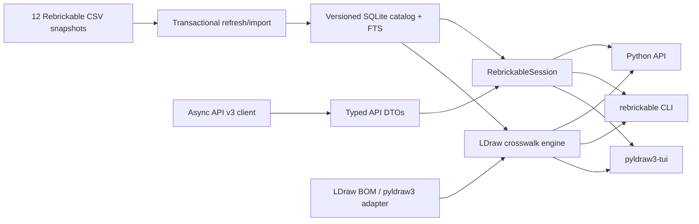

# `rebrickable` Library and TUI Integration Specification

Target distribution, import package, and command: `rebrickable`

## 1. Purpose

Build a typed, asynchronous Python library for the Rebrickable catalog, API v3,
inventories, and LDraw cross-referencing. The library is the data and behavior layer for
future Rebrickable support in `pyldraw3-tui`; the TUI must remain a thin, read-only
presentation layer.

The library must be useful in three contexts from its first stable release:

1. Python code and coding agents finding and inspecting LEGO parts.
2. A terminal UI browsing parts and sets without requiring an API key.
3. Translating an LDraw bill of materials into Rebrickable part/color identifiers while
   making unresolved and ambiguous mappings explicit.

## 2. Upstream facts and constraints

Primary sources:

- [Rebrickable downloads](https://rebrickable.com/downloads/)
- [Rebrickable API v3 guide](https://rebrickable.com/api/v3/docs/?key=)
- [Rebrickable Swagger 2.0 document](https://rebrickable.com/api/v3/swagger/?format=openapi)

The implementation must encode these upstream constraints:

- Rebrickable publishes 12 compressed CSV catalog files and says they are regenerated
  daily. Bulk catalog work must use these files rather than crawling the API.
- Every API call requires an API key. The client must authenticate with the
  `Authorization: key ...` header, not a query parameter, so secrets do not enter URLs,
  logs, caches, or browser history.
- List responses are paginated. The implementation must not depend on the server's
  default page size; automatic pagers should request the documented maximum of 1,000.
- Accounts are allowed about one request per second with a small burst allowance. A 429
  response must slow or stop the client; repeated immediate retries risk a temporary or
  permanent ban.
- The API contains official LEGO catalog data and user collection operations. It does not
  provide general MOCs, MOC inventories, B-models, sub-sets, or pricing. Alternate-build
  MOCs for a set are the only MOC surface in v3.
- The Swagger document describes paths and parameters but does not provide complete
  response schemas. The library therefore owns hand-written response models and recorded
  contract fixtures.
- API fields may change additively. For example, `print_of` was removed from default part
  search results in 2025 unless `inc_part_details=1` is requested.

The project must vendor a dated copy of the Swagger document for reproducible parity tests.
The document retrieved on 2026-08-01 had SHA-256
`91b49e310f8fb2db4ff7474e2775921897e10319a71ec053cac61f3a40fa7cb6`.
A nightly GitHub Actions run should retrieve the upstream document, regenerate bindings,
and open a PR as needed.

## 3. Product decisions

These decisions are fixed for the first stable release:

| Area | Decision |
| --- | --- |
| Catalog | Ingest all 12 downloadable datasets. |
| Offline behavior | Catalog browse, search, inventory inspection, URL generation, exports, and LDraw translation work without an API key after one explicit refresh. |
| Refresh | Manual only. Startup and ordinary queries perform no network I/O. |
| Inventories | Public catalog queries always select the greatest numeric inventory version for a set or minifigure. No version selector is exposed. |
| API | Implement every operation in the vendored OpenAPI document, including read and mutation operations. |
| TUI mutation scope | Read-only. User collection mutations remain library-only. |
| Concurrency | Public I/O interfaces are asynchronous. |
| Authentication | The library receives the API key as an explicit constructor argument. It never persists the key. The TUI checks `REBRICKABLE_API_KEY`. |
| Images | Never download, cache, or render images. Preserve upstream URL metadata where it is part of a response, but the TUI links to Rebrickable entity pages. |
| LDraw | First-class bidirectional part/color matching, BOM annotation, and explicit unresolved/ambiguous reporting. |
| Search | One coherent search surface across every locally searchable entity. |
| Baseline | Python 3.12+, `uv`, typed public API, dataclasses, platform directories, SQLite, Ruff, pytest, `ty`, and Pyrefly, matching `pyldraw3`. |

The name `rebrickable` was unclaimed on PyPI when this specification was written. Check
again immediately before the first publication.

## 4. Goals and non-goals

### 4.1 Goals

- Make all local catalog operations deterministic, fast, and network-free.
- Offer complete, explicit, typed async coverage of API v3.
- Separate upstream DTOs from stable local domain models.
- Stream large CSVs rather than loading them wholly into memory.
- Refresh transactionally so cancellation or failure never destroys the active catalog.
- Give every result provenance: local snapshot, API operation, user override, or mapping
  strategy.
- Produce bounded, stable JSON/CSV that a coding agent can consume without scraping
  human-formatted terminal output.
- Make uncertainty data, not prose: mappings have statuses and candidates.
- Avoid importing Textual or `pyldraw3` in the mandatory dependency graph.

### 4.2 Non-goals

- Image downloading, thumbnail caching, sixel/kitty rendering, or image archives.
- Automatic background refresh.
- Editing personal Rebrickable data from the first TUI integration.
- Guessing an LDraw mapping when multiple plausible matches remain.
- Generating Python modules for every part, as `pyldraw3` does for LDraw construction.
  Rebrickable entities are data records and should remain runtime-queryable.

## 5. High-level architecture



There are four intentionally separate layers:

1. **Source layer:** CSV download/import and API transport.
2. **Domain layer:** immutable models, inventories, search, URLs, and exports.
3. **Bridge layer:** LDraw/Rebrickable resolution and BOM translation.
4. **Consumer layer:** public Python API, CLI, and later TUI integration.

No UI type may cross into the library. No API JSON dictionary or SQLite row may escape
the source layer.

## 6. Package layout

The new repository should begin with this shape:

```text
rebrickable/
├── __init__.py
├── py.typed
├── api/
│   ├── __init__.py
│   ├── client.py
│   ├── models.py
│   ├── pagination.py
│   ├── transport.py
│   └── decoding.py
├── bridge/
│   ├── __init__.py
│   ├── ldraw.py
│   ├── mappings.py
│   └── models.py
├── catalog/
│   ├── __init__.py
│   ├── database.py
│   ├── importers.py
│   ├── inventory.py
│   ├── models.py
│   ├── queries.py
│   ├── schema.py
│   └── search.py
├── cli.py
├── config.py
├── dirs.py
├── errors.py
├── exports.py
├── progress.py
├── refresh.py
├── session.py
├── types.py
└── urls.py
tests/
├── fixtures/
│   ├── api/
│   ├── csv/
│   └── openapi/
├── integration/
└── ...
docs/
├── api/
├── agent-recipes.md
├── cli.md
├── data-model.md
├── ldraw-bridge.md
└── quickstart.md
```

The distribution name, import package, and console script are all `rebrickable`.

Recommended runtime dependencies:

- `httpx2` for asynchronous HTTP and streaming downloads;
- `platformdirs` for OS-standard configuration, cache, and data locations;
- `PyYAML` for non-secret configuration;
- `aiosqlite` or similar for async catalog reads and transaction control;
- `pydantic` for API payloads, with additive-field tolerance and structured decode
  errors;
- `datamodel-code-generator` to generate Pydantic models from the Swagger document.

`pyldraw3` belongs in an optional `ldraw` extra. Core translation records and algorithms
must not require it.

## 7. Public API principles

### 7.1 General contract

- Public models are `@dataclass(frozen=True, slots=True)` unless controlled mutation is
  intrinsic to the object.
- Identifiers that may contain leading zeroes are always strings: part numbers, set
  numbers, minifigure numbers, element IDs, and design IDs.
- Rebrickable integer primary keys and color/theme/category/list IDs are integers.
- All public functions and methods have complete type annotations.
- All network and persistent catalog I/O is awaitable.
- Pure transformations, URL construction, and export serialization remain synchronous.
- Collection return values are immutable tuples unless streaming is appropriate.
- Methods use keyword-only optional arguments.
- Timestamps are timezone-aware `datetime` values.
- JSON models tolerate additive unknown fields through an immutable `extra` mapping.
  Missing or malformed required fields raise a structured decode error.
- No operation performs hidden network I/O. An object loaded locally is never silently
  “enriched” by the API.

### 7.2 Top-level exports

At minimum, these names should be importable from `rebrickable`:

```python
from rebrickable import (
    ApiPage,
    CatalogState,
    Color,
    Config,
    Inventory,
    InventoryPart,
    LDrawBomItem,
    MappingStatus,
    Minifig,
    Part,
    PartCategory,
    RebrickableClient,
    RebrickableSession,
    SearchHit,
    SearchKind,
    Set,
    Theme,
    TranslationReport,
)
```

Deep imports remain supported for specialized request models and endpoint DTOs.

### 7.3 Intended use

Offline catalog:

```python
from rebrickable import RebrickableSession, SearchKind

async with await RebrickableSession.open() as session:
    hits = await session.search(
        "3001 brick 2 x 4",
        kinds={SearchKind.PART},
        limit=20,
    )
    part = await session.parts.get("3001")
    inventory = await session.sets.inventory("10497-1")
```

API:

```python
from rebrickable import RebrickableClient

async with RebrickableClient(api_key=api_key) as client:
    part = await client.get_part("3001")
    async for lego_set in client.iter_sets(search="Galaxy Explorer"):
        print(lego_set.set_num, lego_set.name)
```

LDraw translation:

```python
from rebrickable import LDrawBomItem, RebrickableSession

items = (
    LDrawBomItem(part_num="3001", color_code=4, quantity=2),
    LDrawBomItem(part_num="3002", color_code=1, quantity=1),
)

async with await RebrickableSession.open() as session:
    report = await session.ldraw.translate_bom(items)
    assert not report.ambiguous_rows
```

## 8. Configuration and filesystem contract

`Config` is non-secret. It may contain:

- `database_path`
- `cache_path`
- `base_url` (default `https://rebrickable.com/api/v3`)
- `downloads_base_url` (default `https://cdn.rebrickable.com/media/downloads`)
- request timeout defaults
- retry/rate-limit defaults
- optional path to user-maintained LDraw mapping overrides
- Rebrickable API key (or from env var)

`Config.load()` returns defaults when the file is absent and raises `ConfigLoadError` when present but invalid. `Config.write()` uses atomic replacement, matching `pyldraw3` behavior.

Use platform-standard paths under an application name of `rebrickable`:

- configuration: `config.yml`
- data: active SQLite catalog and snapshot manifest
- cache: downloaded `.csv.gz` files and refresh staging

`RebrickableClient` requires `api_key: str` at construction. Operations on a user account
also require an explicit `user_token`, either on the client or on the individual call.

## 9. Downloaded catalog contract

### 9.1 Source files and required columns

The importer supports all current files and required columns:

| File | Required columns |
| --- | --- |
| `themes.csv.gz` | `id,name,parent_id` |
| `colors.csv.gz` | `id,name,rgb,is_trans,num_parts,num_sets,y1,y2` |
| `part_categories.csv.gz` | `id,name` |
| `parts.csv.gz` | `part_num,name,part_cat_id,part_material` |
| `part_relationships.csv.gz` | `rel_type,child_part_num,parent_part_num` |
| `elements.csv.gz` | `element_id,part_num,color_id,design_id` |
| `sets.csv.gz` | `set_num,name,year,theme_id,num_parts,img_url` |
| `minifigs.csv.gz` | `fig_num,name,num_parts,img_url` |
| `inventories.csv.gz` | `id,version,set_num` |
| `inventory_parts.csv.gz` | `inventory_id,part_num,color_id,quantity,is_spare,img_url` |
| `inventory_sets.csv.gz` | `inventory_id,set_num,quantity` |
| `inventory_minifigs.csv.gz` | `inventory_id,fig_num,quantity` |

Required columns may appear in any order. A missing or renamed required column aborts the
refresh with `DatasetSchemaError`. Newly added unknown columns produce a diagnostic and are
recorded in the manifest, but do not abort the import. This allows additive upstream changes
without silently claiming support for their semantics.

Parsing rules:

- Use Python's CSV parser; never split on commas manually.
- Decode UTF-8 with BOM tolerance.
- Empty nullable cells become `None`.
- Parse `True` and `False` case-insensitively and reject other boolean tokens.
- Validate `rgb` as six hexadecimal characters but preserve upstream casing only in raw
  provenance; expose normalized uppercase values.
- Keep `part_material` as an opaque string rather than an enum because upstream may add
  values.
- Model relationship types with a known-value enum plus an unknown fallback. Current values
  are Print (`P`), Pair (`R`), Sub-Part (`B`), Mold (`M`), Pattern (`T`), and Alternate (`A`).
- Reject negative quantities. Preserve the documented negative color ID used for unknown
  colors.

### 9.2 Manual refresh algorithm

`await session.refresh_catalog()` is the only normal operation that contacts the downloads
host. It performs these steps:

1. Create a unique staging directory beneath the configured cache directory.
2. Download all 12 gzip files with bounded concurrency and streaming writes.
3. Record URL, ETag, Last-Modified, byte length, SHA-256, and retrieval time in a candidate
   manifest.
4. Validate gzip integrity and required CSV headers for every file.
5. Stream all rows into a new staging SQLite database in dependency order.
6. Build indexes, FTS tables, latest-inventory views, and aggregate counts.
7. Run integrity checks and record row counts.
8. Close the staging database and atomically promote it and its manifest as the active
   snapshot.
9. Remove superseded staging artifacts; retain the active compressed snapshot for
   reproducibility.

The downloads site does not publish an atomic manifest for all daily files. Consequently,
the importer must validate cross-file references before promotion. If it detects evidence of
a mixed upstream generation, it should retry the complete download once after a bounded
delay; a second failure leaves the previous catalog untouched.

Cancellation at any await point must remove or quarantine staging files and preserve the
previous active catalog. Refresh must not hold the active database open for writing.

Conditional requests using ETag or Last-Modified are allowed only during an explicit refresh.
If every file is unchanged, return a `RefreshOutcome.UNCHANGED` report without rebuilding.

### 9.3 Catalog state

`await RebrickableSession.state()` returns a `CatalogState` containing:

- `status`: `READY`, `MISSING`, `UNREADABLE`, `SCHEMA_MISMATCH`, or `IMPORT_REQUIRED`
- resolved paths
- active snapshot ID
- retrieval timestamp
- per-file fingerprints and row counts
- database schema version
- diagnostics

State classification is local and performs no HTTP request. “Stale” is not a startup state,
because only an explicit refresh may compare against upstream.

### 9.4 SQLite logical schema

Use a versioned schema with these source tables:

- `themes(id, name, parent_id)`
- `colors(id, name, rgb, is_trans, num_parts, num_sets, year_from, year_to)`
- `part_categories(id, name)`
- `parts(part_num, name, part_cat_id, material)`
- `part_relationships(rel_type, child_part_num, parent_part_num)`
- `elements(element_id, part_num, color_id, design_id)`
- `sets(set_num, name, year, theme_id, num_parts, image_url)`
- `minifigs(fig_num, name, num_parts, image_url)`
- `inventories(id, version, owner_num)`
- `inventory_parts(inventory_id, part_num, color_id, quantity, is_spare, image_url)`
- `inventory_sets(inventory_id, set_num, quantity)`
- `inventory_minifigs(inventory_id, fig_num, quantity)`

`owner_num` is polymorphic because the upstream inventory may belong to a set or minifigure.
Do not add an invalid single-table foreign key for it.

Also maintain:

- a `snapshot_meta` table with schema and source fingerprints;
- an `api_crosswalk_cache` table for API-confirmed external identifiers;
- a `user_mapping_overrides` table loaded from the configured override file;
- FTS5 tables for unified search;
- a `latest_inventories` view selecting the maximum numeric `version` per `owner_num`;
- indexes for every join and public filter, especially part/color inventory lookups.

All 12 datasets and every inventory version are stored. Public domain queries join through
`latest_inventories` and never expose a version argument.

Database migrations are explicit and transactional. If a source reimport is simpler and safer
than an in-place migration, mark the catalog `IMPORT_REQUIRED` and rebuild from the retained
compressed snapshot.

## 10. Local domain model

Core immutable models:

- `Theme(id, name, parent_id)` with explicit parent/children query methods.
- `Color(id, name, rgb, is_trans, num_parts, num_sets, year_from, year_to)`.
- `PartCategory(id, name)`.
- `Part(part_num, name, category_id, material)`.
- `PartRelationship(type, child_part_num, parent_part_num)`.
- `Element(element_id, part_num, color_id, design_id)`.
- `Set(set_num, name, year, theme_id, num_parts, image_url)`.
- `Minifig(fig_num, name, num_parts, image_url)`.
- `InventoryPart(part, color, quantity, is_spare, element_ids)`.
- `InventorySet(set, quantity)`.
- `InventoryMinifig(minifig, quantity)`.
- `Inventory(owner_num, version, parts, sets, minifigs)`.
- `BomRow(part, color, quantity, provenance)`.

Image URLs remain metadata because they are present upstream, but the library provides no
method that fetches them.

Repository facades on `RebrickableSession`:

- `session.parts`
- `session.sets`
- `session.minifigs`
- `session.colors`
- `session.themes`
- `session.categories`
- `session.elements`
- `session.ldraw`

Every facade supports `get()` returning `T | None` and `require()` raising a typed
`EntityNotFoundError`. Lists use stable ordering and explicit `limit`/`offset` arguments.

### 10.1 Inventory operations

Required operations:

- `await session.sets.inventory(set_num)`
- `await session.minifigs.inventory(fig_num)`
- `await session.sets.bill_of_materials(set_num, include_spares=False)`
- `await session.minifigs.bill_of_materials(fig_num, include_spares=False)`

`inventory()` returns the upstream structure: direct parts, contained sets, and minifigures.

`bill_of_materials()` recursively expands contained sets and minifigures, aggregates by
`(part_num, color_id)`, excludes spares by default, and returns root-to-leaf provenance for
each contribution. It detects cycles and raises `InventoryCycleError` containing the owner
path. The operation uses only newest inventory versions.

## 11. Unified search

`session.search()` is the canonical local search API:

```python
async def search(
    query: str,
    *,
    kinds: set[SearchKind] | None = None,
    filters: SearchFilters | None = None,
    limit: int = 50,
    offset: int = 0,
) -> SearchResult: ...
```

`SearchKind` includes `PART`, `SET`, `MINIFIG`, `THEME`, `PART_CATEGORY`, `COLOR`, and
`ELEMENT`.

Search fields include:

- canonical identifiers and names for every kind;
- set year, theme, and part-count filters;
- part category and material;
- element and design IDs;
- part relationship identifiers;
- cached API external IDs when available;
- LDraw codes from confirmed or overridden mappings.

Ranking is deterministic:

1. exact canonical identifier;
2. exact external/LDraw/element identifier;
3. canonical identifier prefix;
4. exact normalized name;
5. normalized name prefix;
6. all-token full-text match;
7. substring fallback.

Ties sort by entity kind and canonical ID. `SearchHit` contains `kind`, `canonical_id`,
`title`, `subtitle`, `score`, `matched_field`, and `matched_value`. The result includes total
count and active snapshot ID.

Search must safely escape FTS syntax. Empty queries require filters or a specific kind and
return a bounded browse result rather than the entire database.

## 12. Async API v3 client

### 12.1 Client lifecycle

```python
async with RebrickableClient(
    api_key=api_key,
    user_token=user_token,
) as client:
    ...
```

The client owns an `httpx.AsyncClient` unless a transport is injected. It supports:

- configurable connect/read/write/pool timeouts;
- an injectable `AsyncTransport` protocol for tests;
- default pacing of one request per second per client;
- cancellation-safe response streaming;
- sanitized request metadata;
- retries for transient connection failures and selected 5xx responses;
- conservative handling of 429 using `Retry-After` when supplied, otherwise the response
  detail, then bounded exponential backoff with jitter;
- no retries for non-idempotent mutations unless the caller explicitly opts in with an
  idempotency policy appropriate to that operation.

List methods return `ApiPage[T]` with `count`, `next`, `previous`, and `results`.
Corresponding `iter_*` methods follow `next` links asynchronously, detect pagination loops,
and request `page_size=1000` by default. `next` URLs are validated to remain HTTPS and on the
configured Rebrickable host before following them.

### 12.2 API DTOs

Define typed DTOs for every distinct response and mutation payload, including:

- catalog color, category, element, part, part/color, set, theme, minifigure, inventory
  part/set/minifigure, and alternate build;
- external ID mappings;
- user token, profile, badge, build result, lost part, user minifigure, user part, and user
  set;
- part-list/list-part and set-list/list-set records;
- request records for every create, replace, partial update, sync, and batch operation.

API DTOs and local catalog models are different types. Conversion methods deliberately
discard transport-only fields and attach provenance.

Because upstream response schemas are incomplete, implementation follows this process for
each operation:

1. Record a redacted real response fixture using a dedicated test account where necessary.
2. Define required and optional fields from the fixture and documentation.
3. Decode unknown additive fields into `extra`.
4. Add a unit contract test for success and each documented error status.
5. Add the operation ID to the parity registry only after the typed test passes.

### 12.3 Complete operation parity

The vendored specification currently has 63 operations. Every row below must have one public
async method. Names in parentheses are upstream operation IDs used by the parity test.

#### Catalog and specification

- `list_colors` (`lego_colors_list`)
- `get_color` (`lego_colors_read`)
- `get_element` (`lego_elements_read`)
- `list_minifigs` (`lego_minifigs_list`)
- `get_minifig` (`lego_minifigs_read`)
- `list_minifig_parts` (`lego_minifigs_parts_list`)
- `list_minifig_sets` (`lego_minifigs_sets_list`)
- `list_part_categories` (`lego_part_categories_list`)
- `get_part_category` (`lego_part_categories_read`)
- `list_parts` (`lego_parts_list`)
- `get_part` (`lego_parts_read`)
- `list_part_colors` (`lego_parts_colors_list`)
- `get_part_color` (`lego_parts_colors_read`)
- `list_part_color_sets` (`lego_parts_colors_sets_list`)
- `list_sets` (`lego_sets_list`)
- `get_set` (`lego_sets_read`)
- `list_set_alternates` (`lego_sets_alternates_list`)
- `list_set_minifigs` (`lego_sets_minifigs_list`)
- `list_set_parts` (`lego_sets_parts_list`)
- `list_set_sets` (`lego_sets_sets_list`)
- `list_themes` (`lego_themes_list`)
- `get_theme` (`lego_themes_read`)
- `get_openapi_spec` (`swagger_list`)

#### Authentication and general user data

- `create_user_token` (`users__token_create`)
- `list_badges` (`users_badges_list`)
- `get_badge` (`users_badges_read`)
- `list_user_all_parts` (`users_allparts_list`)
- `get_user_build_requirements` (`users_build_read`)
- `list_user_lost_parts` (`users_lost_parts_list`)
- `add_user_lost_parts` (`users_lost_parts_create`)
- `delete_user_lost_part` (`users_lost_parts_delete`)
- `list_user_minifigs` (`users_minifigs_list`)
- `list_user_parts` (`users_parts_list`)
- `get_user_profile` (`users_profile_read`)

#### Part lists

- `list_user_part_lists` (`users_partlists_list`)
- `create_user_part_list` (`users_partlists_create`)
- `get_user_part_list` (`users_partlists_read`)
- `replace_user_part_list` (`users_partlists_update`)
- `update_user_part_list` (`users_partlists_partial_update`)
- `delete_user_part_list` (`users_partlists_delete`)
- `list_user_part_list_parts` (`users_partlists_parts_list`)
- `add_user_part_list_parts` (`users_partlists_parts_create`)
- `get_user_part_list_part` (`users_partlists_parts_read`)
- `replace_user_part_list_part` (`users_partlists_parts_update`)
- `delete_user_part_list_part` (`users_partlists_parts_delete`)

#### Set lists and collection sets

- `list_user_set_lists` (`users_setlists_list`)
- `create_user_set_list` (`users_setlists_create`)
- `get_user_set_list` (`users_setlists_read`)
- `replace_user_set_list` (`users_setlists_update`)
- `update_user_set_list` (`users_setlists_partial_update`)
- `delete_user_set_list` (`users_setlists_delete`)
- `list_user_set_list_sets` (`users_setlists_sets_list`)
- `add_user_set_list_sets` (`users_setlists_sets_create`)
- `get_user_set_list_set` (`users_setlists_sets_read`)
- `replace_user_set_list_set` (`users_setlists_sets_update`)
- `update_user_set_list_set` (`users_setlists_sets_partial_update`)
- `delete_user_set_list_set` (`users_setlists_sets_delete`)
- `list_user_sets` (`users_sets_list`)
- `add_user_sets` (`users_sets_create`)
- `sync_user_sets` (`users_sets_sync_create`)
- `get_user_set` (`users_sets_read`)
- `set_user_set_quantity` (`users_sets_update`)
- `delete_user_set` (`users_sets_delete`)

`sync_user_sets` is destructive replacement. It must require the keyword-only sentinel
`confirm_replace=True`; the library must never infer consent or prompt interactively.
`set_user_set_quantity` must document the upstream special case: it may create a missing set,
and quantity zero deletes it.

Single and batch mutation payloads must follow the documented content types. Batch methods
return explicit accepted and skipped records where the upstream response permits it.

### 12.4 API parity enforcement

CI parses the vendored Swagger document and asserts:

- every `(method, path, operationId)` has a registered public method;
- each public method declares supported path/query/form/body parameters;
- no stale registry entry points to a removed operation;
- list operations have both page and iterator tests;
- mutation methods use the correct HTTP verb and encoding.

An upstream comparison job reports drift but does not silently generate or publish new public
methods. New endpoints require review, models, fixtures, and release notes.

## 13. LDraw bridge

### 13.1 Dependency boundary

The core bridge consumes neutral records:

```python
@dataclass(frozen=True, slots=True)
class LDrawBomItem:
    part_num: str
    color_code: int
    quantity: int


@dataclass(frozen=True, slots=True)
class LDrawColorInfo:
    code: int
    name: str
    rgb: str
    alpha: int
```

The optional `rebrickable[ldraw]` extra adds adapters:

- `LDrawBomItem.from_pyldraw_bom(...)`
- `await session.ldraw.translate_model(model, parts=parts)`
- `await session.ldraw.annotate_pyldraw_bom(...)`

The adapter targets the current public `pyldraw3` API and must not read its private SQLite
schema or generated modules.

### 13.2 Part mapping

Every mapping result is a `PartMatch` with:

- source and target identifiers;
- `status`: `RESOLVED`, `AMBIGUOUS`, or `UNRESOLVED`;
- `source`: `USER_OVERRIDE`, `API_EXTERNAL_ID`, `EXACT_CANONICAL_ID`,
  `RELATIONSHIP_CANDIDATE`, or `NONE`;
- confidence;
- candidate matches;
- explanation and snapshot/provenance.

Resolution order:

1. Explicit user override.
2. Previously cached API-confirmed LDraw external ID.
3. Exact normalized LDraw code to Rebrickable `part_num`.
4. Relationship-derived candidates.
5. Unresolved.

Normalization removes a trailing `.dat`, normalizes slash direction and case, but does not
strip meaningful print/pattern suffixes. An exact normalized identifier match is safe to
resolve. Relationship-derived alternatives are candidates unless a curated override marks
one as equivalent.

The API may be used only on explicit enrichment or lookup calls, never implicitly during a
bulk BOM translation. API-confirmed mappings are stored with retrieval time and upstream
response provenance. The library must not perform one API request per BOM row automatically.

Bidirectional operations:

- `resolve_ldraw_part(ldraw_code)`
- `resolve_rebrickable_part(part_num)`
- `find_ldraw_candidates(part_num)`
- `record_part_override(...)`
- `remove_part_override(...)`

### 13.3 Color mapping

Every color mapping is a `ColorMatch` with the same status/provenance shape.

Resolution order:

1. Explicit user override.
2. Cached API-confirmed LDraw external color ID.
3. Unique exact RGB plus transparency match.
4. Unique normalized-name plus transparency match.
5. Ambiguous or unresolved.

LDraw alpha below fully opaque maps to Rebrickable transparency for candidate generation,
but alpha differences are retained in the explanation. Multiple Rebrickable colors sharing
an RGB value must never be collapsed silently.

Bidirectional operations mirror part operations.

### 13.4 BOM translation and annotation

`translate_bom()` returns `TranslationReport` containing:

- one `TranslatedBomRow` per source `(part, color)` row;
- resolved Rebrickable part/color identifiers where available;
- quantities unchanged;
- part and color match provenance;
- candidates and explanations;
- aggregate resolved, ambiguous, and unresolved counts;
- active catalog snapshot ID.

A row is fully resolved only when both part and color are resolved. Translation never replaces
an original LDraw identifier; annotation adds Rebrickable fields alongside it.

Required exports:

- deterministic JSON;
- RFC 4180 CSV;
- a compact human table;
- unresolved-only JSON/CSV.

CSV columns are stable:

```text
ldraw_part_num,ldraw_color_code,rebrickable_part_num,rebrickable_color_id,
quantity,status,part_match_source,color_match_source,candidates,notes
```

## 14. URLs, exports, and agent ergonomics

Pure URL builders must quote identifiers and require no API key:

- `part_url(part_num)`
- `set_url(set_num)`
- `minifig_url(fig_num)`
- `theme_url(theme_id)` where Rebrickable has a stable public route

Entity records should expose `page_url`, constructed locally. The TUI opens these pages and
does not open image URLs.

Export helpers cover:

- entity identifiers and links;
- set/minifigure structured inventories;
- flattened BOMs;
- missing/unresolved parts;
- LDraw translation reports;
- ready-to-run Python snippets using public top-level imports.

Machine-output rules:

- JSON is schema-versioned and sorted deterministically.
- Datetimes use ISO 8601 UTC.
- Enums serialize to stable string values.
- `--json` writes only JSON to stdout; progress and diagnostics go to stderr.
- Commands have documented nonzero exit codes for missing data, invalid input, incomplete
  translation, API failure, and unexpected failure.
- Every list output is bounded unless an explicit `--all` is given.
- Secrets and user tokens never appear in output, reprs, exception text, or fixtures.

Publish `docs/agent-recipes.md` with short, tested recipes for search, exact lookup, set BOM,
LDraw translation, API pagination, and safe user-list mutations. This is part of the release,
not optional marketing documentation.

## 15. Error and progress contracts

All library errors derive from `RebrickableError`.

Required families:

- configuration: `ConfigLoadError`
- local data: `CatalogUnavailableError`, `CatalogUnreadableError`,
  `CatalogSchemaError`, `EntityNotFoundError`
- refresh: `DownloadError`, `DatasetIntegrityError`, `DatasetSchemaError`,
  `CatalogImportError`
- API: `ApiError`, `ApiAuthenticationError`, `ApiForbiddenError`,
  `ApiNotFoundError`, `ApiThrottledError`, `ApiServerError`, `ApiDecodeError`
- pagination: `PaginationCycleError`, `UnsafePaginationUrlError`
- inventory: `InventoryNotFoundError`, `InventoryCycleError`
- authentication: `UserTokenRequiredError`

API errors contain status, sanitized path template, operation ID, safe detail, request ID when
available, and parsed retry delay. They do not contain request headers, key-bearing URLs,
passwords, or full user-token paths.

Long-running operations accept a lightweight progress callback and emit immutable
`ProgressEvent` values with:

- stage: `DOWNLOAD`, `VALIDATE`, `IMPORT`, `INDEX`, `PROMOTE`, `DONE`
- dataset name
- current and total where known
- unit: bytes, rows, files, or steps
- safe message and path

Callbacks execute quickly on the event-loop thread. CPU/blocking CSV import work runs in a
worker and forwards progress safely. Native task cancellation is the primary cancellation
mechanism.

## 16. Command-line interface

The `rebrickable` command is a non-interactive, scriptable facade over the library.

Required commands:

```text
rebrickable status [--json]
rebrickable refresh [--force] [--json]
rebrickable search QUERY [--kind KIND] [--limit N] [--json]
rebrickable part PART_NUM [--json]
rebrickable set SET_NUM [--inventory | --bom] [--include-spares] [--json|--csv]
rebrickable minifig FIG_NUM [--inventory | --bom] [--include-spares] [--json|--csv]
rebrickable url {part|set|minifig} ID
rebrickable translate-ldraw MODEL [--json|--csv] [--unresolved-only]
rebrickable api-spec [--output PATH]
```

The catalog CLI does not need an API key. If later API-specific CLI commands are added, they
read `REBRICKABLE_API_KEY`; do not encourage a plaintext `--api-key` command-line argument.
Username/password token generation, if exposed at all, reads the password from a secure prompt
or stdin and never from argv.

Consider alternatively:An analogous CLI could offer:

```text
rebrickable download
rebrickable catalog status
rebrickable parts search
rebrickable parts info 2412b --system ldraw
rebrickable parts colors 99780
rebrickable resolve ldraw:2412b
rebrickable bom validate model.csv
rebrickable bom normalize model.csv
rebrickable bom diff old.csv new.csv
rebrickable sets inventory 10300-1
```

Machine-readable `--json` output would make it easy to integrate with pyldraw generators and CI.

The library must still implement every API mutation even though the initial CLI and TUI expose
only the safe subset above.

## 17. Validation, Identifiers, and BOM's

### 17.1. Explicit identifier systems

Do not represent a part with just a string. Use typed references:

```python
PartRef("ldraw", "2412b")
PartRef("rebrickable", "2412b")
PartRef("lego", "4211414")
PartRef("bricklink", "2412b")
```

Likewise, colors should include their namespace:

```python
ColorRef("ldraw", 4)
ColorRef("rebrickable", 4)
```

Red happens to be ID 4 in both systems, but the library must never assume color IDs correspond.

Useful operations:

```python
catalog.resolve_part(PartRef("ldraw", "2412b"))
catalog.resolve_color(ColorRef("ldraw", 4))
catalog.external_ids(part)
catalog.elements(part=part, color=color)
```

Resolution results should distinguish:

- Exact match
- Known external-ID mapping
- Mold/part variant
- Printed or decorated derivative
- Ambiguous match
- No match

### 17.2. Part/color availability validation

This is the key workflow from the Scout build:

```python
result = catalog.check_part_color(
    PartRef("ldraw", "99780"),
    ColorRef("ldraw", 4),
)
```

Return structured evidence, rather than only `True` or `False`:

```python
PartColorAvailability(
    available=True,
    rebrickable_part="99780",
    rebrickable_color=4,
    element_ids=("6335388",),
    set_count=12,
    first_year=2012,
    last_year=2025,
    confidence="exact",
)
```

Important distinctions:

- A part/color element exists.
- It appears in an official inventory.
- It appears only as a spare.
- It existed historically but may not be currently produced.
- It is merely a compatible mold substitution.

That prevents “manufactured in this color” from being confused with “currently easy to purchase.”

### 17.3. First-class BOM support

Create a `Bom` type with deterministic normalization:

```python
bom = Bom.from_csv("model-bom.csv")
report = catalog.validate_bom(
    bom,
    part_system="ldraw",
    color_system="ldraw",
)
```

It should support:

- `Part,Color,Quantity` CSV.
- Rebrickable inventory CSV/XML formats.
- Aggregation and stable sorting.
- BOM comparison and diffs.
- Duplicate-row detection.
- Unknown part/color reporting.
- Total and unique-part counts.
- Exact versus substitutable inventory.
- Export suitable for uploading to a Rebrickable custom list.

For this project, a report could have directly stated:

```text
360 occurrences
107 part/color combinations
36 red part IDs checked
36 exact color matches
0 unavailable combinations
```

### 17.4. Substitution and compatibility

LEGO identifiers frequently have mold revisions and aliases. Model this as a graph rather than a single replacement field:

```python
catalog.substitutes(
    part,
    direction="both",
    include_mold_variants=True,
    include_prints=False,
)
```

Useful relationship categories include:

- Alternate mold
- Superseded by
- Print of
- Patterned version
- Assembly/component
- Functional substitute
- External-system alias

The result should explain why a substitution is suggested and whether it changes appearance or geometry.

## 18. Security, privacy, and robustness

- Validate all pagination hosts and schemes.
- Set timeouts on every network operation.
- Bound response sizes where practical and stream downloads.
- Refuse unsafe archive paths if ZIP support is added; gzip CSVs require no extraction tree.
- Use parameterized SQL exclusively.
- Treat search input as data and escape FTS syntax.
- Use staged writes and atomic promotion for config, manifest, and catalog replacement.
- `sync_user_sets` requires explicit destructive confirmation in the method call.
- API mutation retries are disabled by default where replay could duplicate or replace data.
- Test that object reprs and every exception path do not reveal secrets.

## 19. Test and quality plan

Match or exceed `pyldraw3`'s quality baseline:

- Python 3.12, 3.13, and 3.14 CI.
- Ruff format and all-rule lint with documented narrow exceptions.
- `ty`, Pyrefly, deptry, and Pyroma.
- Branch coverage target of at least 97%.
- `pytest-asyncio` for async tests.
- No network in the default test suite.

Required test groups:

1. **CSV contracts:** quoted commas, Unicode, nullable fields, booleans, leading zeroes,
   malformed rows, unknown columns, missing columns, and all 12 importers.
2. **Refresh safety:** partial downloads, corrupt gzip, mixed snapshot references, cancellation
   at every stage, unchanged ETags, and failed atomic promotion.
3. **Catalog queries:** exact lookup, hierarchy, relationships, current inventory selection,
   recursive BOM aggregation, spare handling, and cycle detection.
4. **Search:** every entity kind and identifier class, ranking order, filters, FTS injection,
   deterministic pagination, and empty-query bounds.
5. **API operations:** typed success fixture for all 63 operations, parameter encoding, verbs,
   pagination, batch bodies, every documented error status, 429 pacing, and secret redaction.
6. **OpenAPI parity:** no missing or stale operation registrations.
7. **LDraw bridge:** normalization, overrides, exact matches, relationship candidates,
   RGB/name colors, ambiguous colors, bidirectional lookup, report counts, and provenance.
8. **Exports/CLI:** golden JSON/CSV, stdout/stderr separation, stable exit codes, URL quoting,
   and snippets that import and execute.
9. **Optional integration:** current downloads, live read-only API calls, and a separate guarded
   test account for mutation round trips with cleanup.

Performance acceptance on the full catalog should be measured and recorded in CI artifacts:

- import memory remains bounded by streaming rather than source-file size;
- warm exact lookup is effectively instantaneous;
- a typical unified search returns in under 150 ms on the documented reference machine;
- startup opens the existing local database without a schema-wide materialization pass.

Do not make wall-clock thresholds hard CI failures until a stable reference runner exists.

## 20. Definition of done for the library

The library is ready for TUI consumption when all of the following are true:

- all 12 datasets refresh atomically and can be queried offline;
- all 63 vendored OpenAPI operations have explicit async methods and typed tests;
- unified search covers every specified kind and external identifiers when locally known;
- set and minifigure inventory queries consistently select newest versions;
- structured and flattened inventories export deterministically;
- LDraw parts and colors resolve bidirectionally with provenance and never hide ambiguity;
- LDraw BOM translation produces complete resolved/ambiguous/unresolved reports;
- API keys are constructor arguments and are never persisted or leaked;
- ordinary session startup and queries perform zero network calls;
- manual refresh cancellation preserves the active catalog;
- CLI JSON/CSV contracts and exit codes are documented and tested;
- the full quality suite passes on every supported Python version;
- public documentation includes human quick starts and agent-oriented recipes.

## 21. Explicit limitations to communicate

- “Fully useful without a key” applies to downloaded official catalog data, inventories,
  search, exports, page links, and offline mapping strategies. Live user collections and
  API-only external identifiers inherently require credentials.
- Exact Rebrickable and LDraw identifiers overlap often, but not universally. Offline
  translation must report gaps; it cannot manufacture official crosswalk data absent from
  the CSV files.
- Relationship records provide candidates, not guaranteed physical interchangeability.
- Public inventory queries intentionally hide historical versions even though the source
  rows remain stored.
